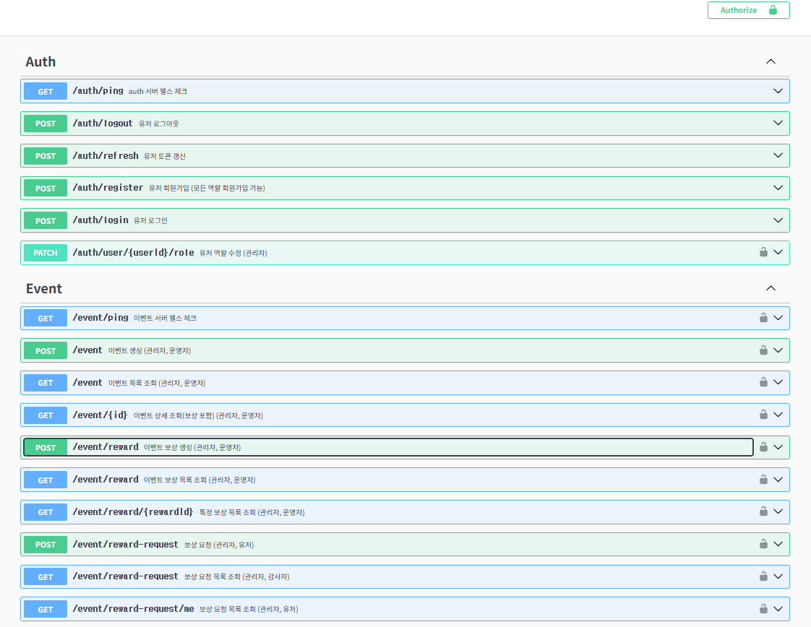

# 이벤트 및 보상 관리 플랫폼



## 👋 소개

이벤트 및 보상 관리 플랫폼(NERS) 프로젝트입니다.
NestJS와 MSA(Microservice Architecture), MongoDB를 기반으로 설계 및 구현되었습니다.

DDD(Domain-Driven Design)의 원칙을 일부 적용하여 도메인 로직의 명확성과 시스템의 유지보수성을 높이고자 노력했습니다.

## 🚀 실행 방법 (Docker Compose)

1. .env.example 파일을 .env파일로 복사합니다.
1. 프로젝트 루트 디렉토리에서 다음 명령어를 실행하여 모든 서비스를 빌드하고 실행합니다.
   ```bash
   docker-compose up --build
   ```
1. API 문서는 각 서비스의 `/api` 경로에서 확인할 수 있습니다 (예: `http://localhost:3000/api` - Auth Server).

## 흐름도

```
+-----------+                                 +-----------------+
|  Client   | --1. API Request (with JWT)--> |  Gateway Server |
+-----------+                                 +-----------------+
                                                    |
                                                    | 2. JWT 검증 (서명, 만료)
                                                    |    (Gateway 자체 수행)
                                                    |
                                                    | 3. 역할 검사 (필요시)
                                                    |    (Gateway 자체 수행, JWT 내 role 정보 사용)
                                                    |
                                       (성공 시)    V
                            +--------------------------------------+
                            | 4. 라우팅 & 프록시                     |
                            +------------------+-------------------+
                                               | (요청 종류에 따라)
                                               V
+-----------------+                  +-----------------+
|   Auth Server   | <--(예: /users/me) |  Event Server   | <--(예: /events)
+-----------------+                  +-----------------+
    ^ (응답)                               ^ (응답)
    |                                      |
    +-----------(응답)--------------------(응답)-----------+
                                                    |
                                                    V
                                              (응답 전달)
+-----------+                                 +-----------------+
|  Client   | <---6. API Response------------ |  Gateway Server |
+-----------+                                 +-----------------+

```

## 🧱 기술 스택

- **Node.js:** v18 (고정)
- **Framework:** NestJS (최신 버전)
- **Language:** TypeScript
- **Database:** MongoDB
- **Authentication:** JWT (JSON Web Token) - Access Token & Refresh Token 방식
- **API Documentation:** Swagger (OpenAPI)
- **Deployment/Runtime:** Docker, Docker Compose

## 참고사항

- gateway-server, auth-server, event-server는 nestjs monorepo를 이용하였습니다.
- 유저가 보상 여건이 충족했는지 확인하기 위해서 유저 행동 값은 임의 생성하였습니다. `getMockUserActivityData`함수
- gateway-server의 swagger파일을 확인하실 수 있습니다.
  - 서비스 실행 후 http://localhost:3000/api
  - auth-server, event-server의 api를 확인하실 수 있습니다.
- access token 유효시간은 1시간입니다.

## 🧩 서버 구성 및 역할

본 프로젝트는 3개의 서버로 구성된 마이크로서비스 아키텍처를 따릅니다.

1.  **Gateway Server (`gateway-server`):**

    - 모든 API 요청의 단일 진입점(Single Entry Point).
    - JWT 기반 인증 및 역할(Role) 기반 인가 수행.
    - 요청 경로에 따라 적절한 백엔드 서비스(Auth, Event)로 라우팅 (HTTP Proxy).

2.  **Auth Server (`auth-server`):**

    - 사용자 계정 관리 (회원가입, 로그인).
    - JWT (Access Token, Refresh Token) 발급, 셔신, 무효화 관리.
    - 사용자 역할(Role) 관리 기능 제공 (ADMIN 권한).
    - **도메인:** account

3.  **Event Server (`event-server`):**
    - 이벤트 생성, 조회, 수정, 상태 변경 관리 (운영자/관리자).
    - 이벤트에 연결된 보상 정보 정의 및 관리 (운영자/관리자).
    - 사용자의 보상 요청 처리 및 조건 검증.
    - 보상 지급 상태 저장 및 요청 내역 조회 기능.
    - **도메인:** Event, Reward, Reward Request

## 🔧 기능 상세

### Gateway Server

- **인증/인가:**
  - `@nestjs/passport`, `passport-jwt`를 사용한 JWT Access Token 검증.
  - `RolesGuard`를 통한 역할 기반 접근 제어.
  - `@Public()` 데코레이터를 통해 인증 없이 접근 가능한 API 지정.
- **라우팅:**
  - 요청 URL 패턴(` /auth/**`, `/events/**` 등)에 따라 Auth Server 또는 Event Server로 프록시.
  - 인증된 사용자 정보(ID, 역할 등)를 커스텀 HTTP 헤더(`X-User-ID`, `X-User-Role`)에 담아 백엔드 서비스로 전달.

### Auth Server (IAM Domain)

- **사용자 (User):**
  - `POST /auth/register`: 사용자 등록 (비밀번호는 bcrypt로 해싱하여 저장).
  - `User` 엔티티, `UsernameVO`, `PasswordVO` (Plain/Hashed), `RoleVO` 등 값 객체 사용.
- **인증 (Authentication):**
  - `POST /auth/login`: 로그인 성공 시 Access Token 및 Refresh Token 발급.
  - `POST /auth/refresh`: 유효한 Refresh Token으로 새로운 Access Token (및 Refresh Token) 발급 (Refresh Token Rotation 적용).
  - `POST /auth/logout`: Refresh Token 무효화 처리.
  - Refresh Token은 DB에 저장하여 관리 (선택적 무효화, 세션 관리).
- **역할 (Role):**
  - 정의된 역할: `USER`, `OPERATOR`, `AUDITOR`, `ADMIN`.
  - `PATCH /users/{userId}/role` (ADMIN): 특정 사용자의 역할 변경.
  - 역할 변경 시, 해당 사용자의 기존 Refresh Token을 무효화하여 다음 토큰 갱신 시 변경된 역할이 적용되도록 유도.
- **사용자 정보:**
  - `GET /users/me`: 로그인한 자신의 정보 조회.
  - `GET /users` (ADMIN): 전체 사용자 목록 조회.

### Event Server

#### 1. 이벤트 (Event) 도메인

- **기능:**
  - `POST /events` (OPERATOR, ADMIN): 새 이벤트 생성.
    - 이름, 설명, 기간, 상태, 조건, 생성자 정보 포함.
    - `conditions`: 다양한 이벤트 조건(예: `LOGIN_STREAK`, `USER_LEVEL`)을 유연하게 정의할 수 있는 구조. `EventConditionDto`의 `parameters` 객체를 통해 타입별 상세 조건 입력.
  - `GET /events`, `GET /events/{eventId}`: 이벤트 목록 및 상세 조회.
  - `PUT /events/{eventId}` (OPERATOR, ADMIN): 이벤트 정보 수정.
  - `PATCH /events/{eventId}/status` (OPERATOR, ADMIN): 이벤트 상태 변경 (예: `ACTIVE`, `INACTIVE`, `COMPLETED`).

#### 2. 보상 (Reward) 도메인

- **기능:**
  - `POST /events/{eventId}/rewards` (OPERATOR, ADMIN): 특정 이벤트에 보상 정보 추가.
    - 보상 유형(`type`), 상세 내용(`details`)
  - `GET /events/{eventId}/rewards`: 특정 이벤트의 보상 목록 조회.
  - `PUT /rewards/{rewardId}` (OPERATOR, ADMIN): 보상 정보 수정.

#### 3. 보상 요청 (RewardRequest) 도메인

- **기능:**
  - `POST /reward-requests` (USER): 사용자가 특정 이벤트에 대해 보상 요청.
    - **중복 보상 요청 방지:** `userId` + `eventId` (+ `rewardId`) 기준으로 `RewardRequest` 테이블을 조회하여, 이미 성공적으로 처리된 (`APPROVED`, `CLAIMED`) 요청이 있는지 확인.
    - **조건 충족 여부 검증 (`checkEventConditions`):**
      - `EventConditionsVO`에 정의된 조건과 사용자의 실제 활동 데이터(Mock 또는 가상 데이터 소스)를 비교하여 검증.
      - 조건 검증 로직은 유연하게 확장 가능하도록 설계 (예: 조건 유형별 처리).
    - 조건 미충족 또는 중복 시 `REJECTED_...` 상태로 기록.
    - 조건 충족 시 `APPROVED` 상태로 기록 및 (가상) 보상 지급 처리 (예: `Reward` 엔티티의 `remainingQuantity` 차감).
  - `GET /reward-requests/me` (USER): 자신의 보상 요청 내역 조회.
  - `GET /reward-requests` (OPERATOR, AUDITOR, ADMIN): 전체 사용자의 보상 요청 기록 조회 (필터링 기능 선택적 구현).

## 🔐 인증 및 인가 구조

- **인증 (Authentication):**
  - 로그인 시 JWT Access Token(단기)과 Refresh Token(장기, DB 저장) 발급.
  - API 요청 시 `Authorization: Bearer <AccessToken>` 헤더 사용.
  - Gateway Server에서 Access Token 유효성(서명, 만료) 검증.
  - Access Token 만료 시, 클라이언트는 Refresh Token을 사용하여 새로운 Access Token 요청.
- **인가 (Authorization):**
  - Gateway Server의 `RolesGuard`가 JWT 페이로드 내의 `role` 정보와 각 API에 필요한 역할을 비교하여 접근 제어.
  - Auth Server와 Event Server의 중요 API에도 자체적인 `RolesGuard`를 두어 심층 방어 (Defense in Depth).

## 📂 DDD 폴더 및 파일 구조

```
.
├── apps
│   ├── auth-server
│   │   ├── src
│   │   │   └── account
│   │   │       ├── application
│   │   │       │   ├── service
│   │   │       │   └── use-cases
│   │   │       ├── domain
│   │   │       │   ├── entites
│   │   │       │   ├── repositories
│   │   │       │   └── value-objects
│   │   │       └── infrastructure
│   │   │           ├── controller
│   │   │           └── repositories
│   │   │               └── schemas
│   │   └── test
│   ├── event-server
│   │   ├── src
│   │   │   ├── common
│   │   │   ├── event
│   │   │   │   ├── application
│   │   │   │   │   └── use-cases
│   │   │   │   ├── domain
│   │   │   │   │   ├── entites
│   │   │   │   │   └── value-objects
│   │   │   │   └── schemas
│   │   │   ├── reward
│   │   │   │   ├── application
│   │   │   │   │   └── use-cases
│   │   │   │   ├── domain
│   │   │   │   │   ├── entites
│   │   │   │   │   └── value-objects
│   │   │   │   └── schemas
│   │   │   └── reward-request
│   │   │       └── schemas
│   │   └── test
│   └── gateway-server
│       ├── src
│       │   ├── auth
│       │   └── proxy
└──     └── test
```

- **도메인 엔티티:** 순수 TypeScript 클래스로 비즈니스 로직 포함.
- **값 객체 (VO):** 불변성을 가지며 특정 값과 관련된 규칙 캡슐화.
- **애플리케이션 서비스:** 유스케이스 조정, DTO-엔티티 변환, 트랜잭션 관리.
- **리포지토리:** 인터페이스는 도메인 계층에, 구현체는 인프라스트럭처 계층에 위치.
